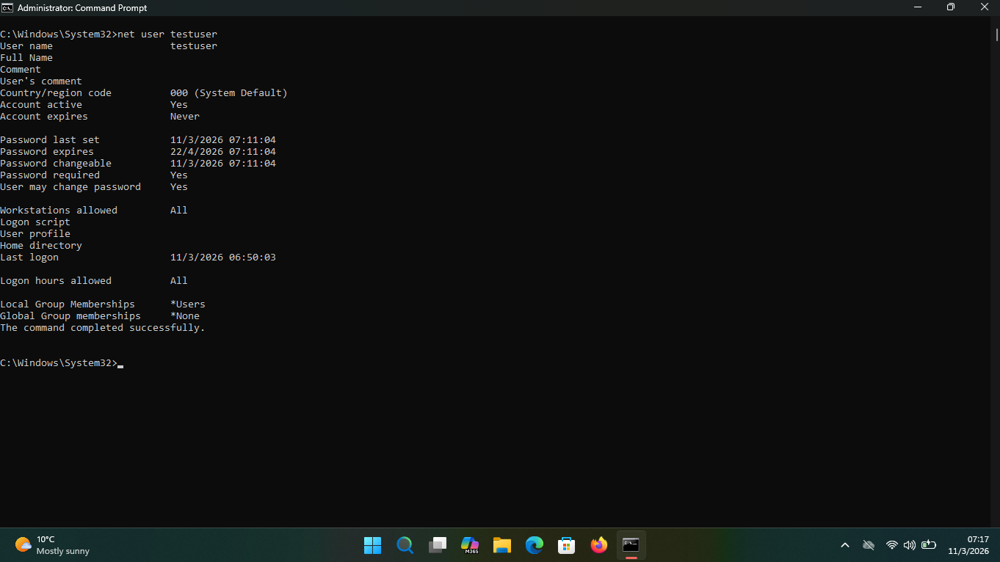

# Windows Help Desk User Management Lab

## Project Summary
A practical Windows command-line lab focused on common Help Desk user administration tasks:
- Password reset for a local user account
- Account reactivation if disabled
- Action logging with date/time timestamps
- Verification of logged activities

This project demonstrates a repeatable support workflow with accountability and clear evidence of what was changed.

## Objective
Practice real Help Desk tasks safely in a home-lab environment and document each step for auditability.

## Commands Used
```bat
mkdir C:\HelpDeskLogs
net user testuser SecurePass2026!
net user testuser Fumimylove123
net user testuser /active:yes
net user testuser /active:no
net user testuser
echo %date% %time% - Reset password for testuser >> C:\HelpDeskLogs\user_reset_log.txt
type C:\HelpDeskLogs\user_reset_log.txt
whoami
```

## Why This Matters
- Supports faster password reset handling
- Handles account reactivation and controlled deactivation during user administration
- Creates timestamped logs for accountability
- Confirms successful actions through account details, log review, and identity verification

## Result
- Created a dedicated `C:\HelpDeskLogs` folder
- Logged and verified support actions in `user_reset_log.txt`
- Verified active session identity with `whoami`
- Established separate local accounts for admin and standard user access

## Screenshot


## Suggested GitHub Repo Name
`windows-helpdesk-user-management-lab`

## Suggested GitHub Description
`Windows CMD help desk lab for user management: password reset, account activate/deactivate, timestamped logging, and verification with whoami.`
